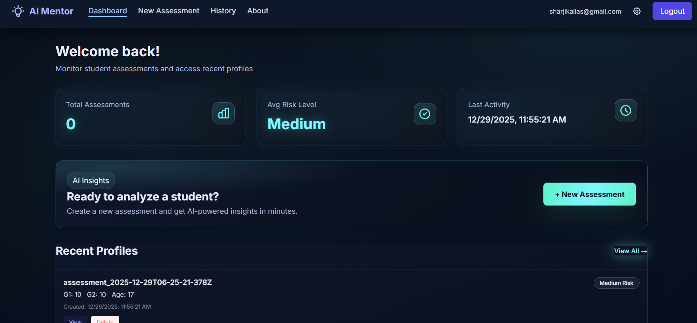
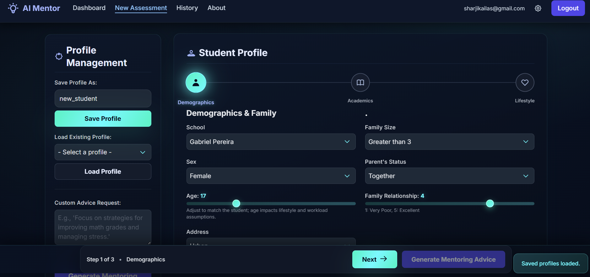
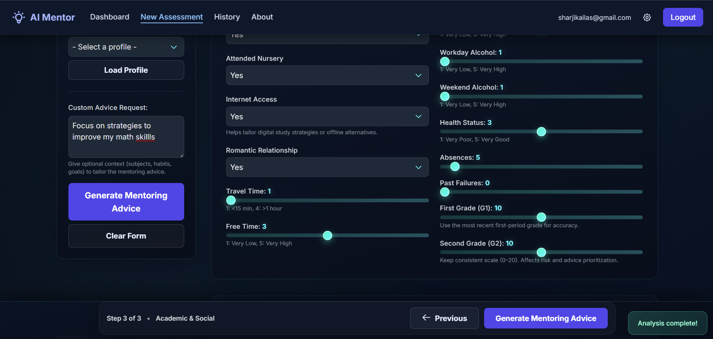
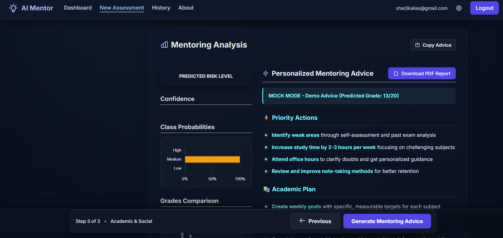
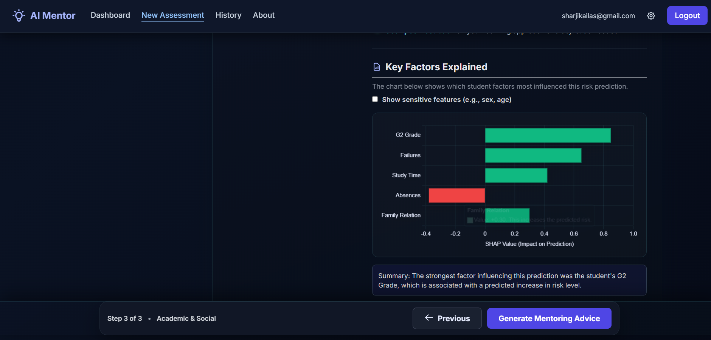
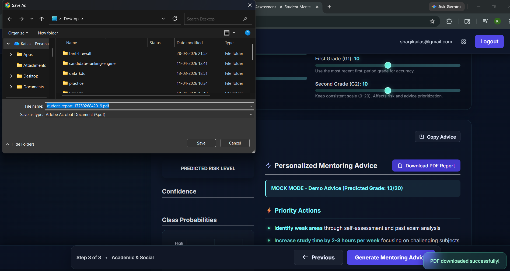

# 🎓 AI Student Mentor: Explainable Risk Prediction System

[](https://www.python.org/)
[](https://flask.palletsprojects.com/)
[](https://scikit-learn.org/)
[](https://deepmind.google/technologies/gemini/)
[](https://tailwindcss.com/)

An end-to-end **Explainable Artificial Intelligence (XAI)** application designed to identify students at academic risk. This system combines **Gradient Boosting Machine Learning** for high-accuracy predictions with **Large Language Models (Gemini)** to provide personalized, actionable mentoring advice.

---

## 🌟 Key Features

### 🧠 Explainable AI (XAI) Dashboard
Unlike "black-box" models, this system utilizes **SHAP (SHapley Additive exPlanations)** values to show exactly which factors (e.g., absences, previous grades, social habits) influenced a student's risk score.

### 🤖 Generative Mentoring Advice
Integrated with **Google Gemini 2.0 Flash**, the app generates customized academic recovery plans based on the specific risk factors identified by the ML model.

### 📊 Comprehensive Student Profiling
A multi-step assessment engine tracks:
- **Academic Performance**: G1/G2 grades and past failures.
- **Social & Lifestyle Factors**: Alcohol consumption, free time, and internet access.
- **Demographic Context**: Family size, parental status, and travel time.

### 📁 Enterprise-Ready Reporting
- **PDF Generation**: Export assessment results into professional PDF reports for faculty review.
- **Firebase Integration**: Secure authentication and persistent assessment history.
- **Faculty Alerts**: Automatic notification triggers for "High-Risk" students.

---

## 📸 Visual Gallery

### 📱 Main Dashboard

*A centralized view for monitoring student assessments and accessing historical data.*

### 📝 Intelligent Assessment Form
| Demographics & Family | Academic & Social Factors |
| :---: | :---: |
|  |  |

### 🔍 Analysis & Explainability

*Real-time risk scoring with confidence intervals and Gemini-powered mentoring advice.*


*SHAP visualization explaining the 'Why' behind every prediction—essential for educational transparency.*

### 📄 Professional reporting

*Generated PDF reports for offline faculty review and documentation.*

---

## 🛠️ Technical Stack

- **Backend**: Flask (Python)
- **Machine Learning**: LightGBM, Scikit-Learn
- **Explainability**: SHAP (SHapley Additive exPlanations)
- **AI Integration**: Google Generative AI (Gemini SDK)
- **Frontend**: Tailwind CSS, Vanilla JS
- **Database/Auth**: Firebase (Firestore & Auth)
- **Reporting**: ReportLab (PDF Engine)

---

## 🚀 Getting Started

### Prerequisites
- Python 3.9+
- Google Gemini API Key
- Firebase Project Credentials

### Installation

1. **Clone the repository**
   ```bash
   git clone https://github.com/yourusername/student-risk-demo.git
   cd student-risk-demo
   ```

2. **Setup Virtual Environment**
   ```bash
   python -m venv venv
   source venv/bin/activate  # On Windows: .\venv\Scripts\activate
   ```

3. **Install Dependencies**
   ```bash
   pip install -r requirements.txt
   ```

4. **Environment Configuration**
   Create a `.env` file in the root directory:
   ```env
   GEMINI_API_KEY=your_key_here
   FIREBASE_API_KEY=your_key_here
   SECRET_KEY=your_random_secret
   ```

5. **Run the Application**
   ```bash
   python run.py
   ```
   Access the app at `http://127.0.0.1:8501`

---

## 📉 Model Performance
The underlying model was trained on the **UCI Student Performance Dataset**, achieving high precision in identifying students likely to fail (`High Risk`). Feature engineering includes:
- **Grade Delta**: Tracking improvement or decline between G1 and G2.
- **Social-Academic Interaction**: Combining alcohol consumption with study time for deeper insights.

---

## 📄 License
Distributed under the MIT License. See `LICENSE` for more information.

---

**Developed for Portfolio & Recruitment Purpose**  
*Contact: [Your Email/LinkedIn]*